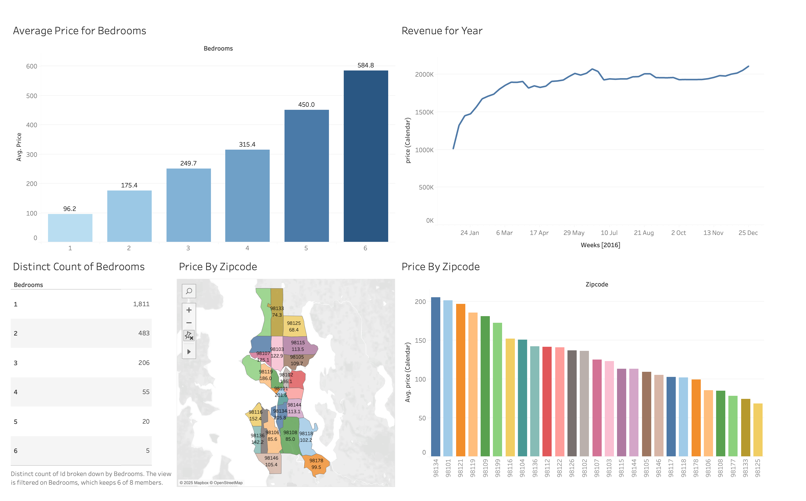

# 📊 Airbnb 2016 USA Visualization

Welcome to the **Airbnb 2016 USA Visualization**! This Tableau dashboard provides a deep dive into Airbnb listings across the United States, helping users uncover key trends, pricing strategies, and market insights. Whether you're a data analyst, Airbnb host, or just curious about the short-term rental market, this visualization delivers valuable insights in an interactive and engaging way.

---

## 📌 Features  

✔ **Interactive Dashboard** – Explore Airbnb listings with dynamic filters and visualizations.  
✔ **Market Trends** – Analyze pricing, occupancy rates, and listing popularity across different cities.  
✔ **Geospatial Analysis** – View Airbnb hotspots and discover which locations have the highest demand.  
✔ **Host & Property Insights** – Understand the distribution of room types, property listings, and host behavior.  
✔ **Revenue Potential** – Identify pricing patterns and revenue trends for strategic decision-making.  

---

## 🛠 Requirements  

- **Tableau** (version 10.0 or higher recommended)  
- **AIRBNB2016visualisation.twbx** (Packaged Workbook)  

---

## 🚀 Usage Instructions  

1. **Open the File** – Download and open the `.twbx` file in Tableau.  
2. **Explore Filters & Views** – Use the interactive filters to customize your data view (e.g., city selection, price range, property type).  
3. **Analyze Trends** – Gain insights into Airbnb pricing, occupancy rates, and top-performing locations.  
4. **Make Data-Driven Decisions** – Use the findings to optimize Airbnb investments, pricing strategies, and hosting potential.  

---

## 📌 Notes  

- The dataset is based on **2016 Airbnb listings in the USA** and may not reflect current market conditions.  
- If you experience any performance issues, consider adjusting filters or aggregating data.  
- Feel free to modify and customize the dashboard to suit your specific needs!  

---

## 🖼 Preview  

  

